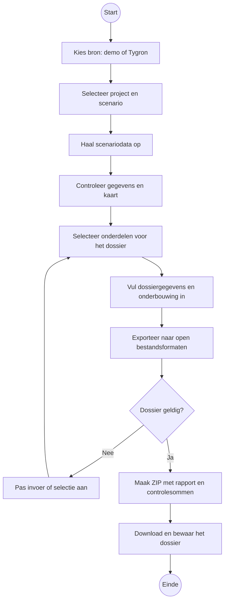

# Procesdiagram ScenarioDossier

Dit compacte schema toont alleen het hoofdproces. De tekst tussen de vierkante haken
kan direct worden aangepast zonder de verbindingen te wijzigen.

## Betekenis van de vormen

- Cirkel: begin of einde.
- Rechthoek: activiteit.
- Ruit: beslissing.

