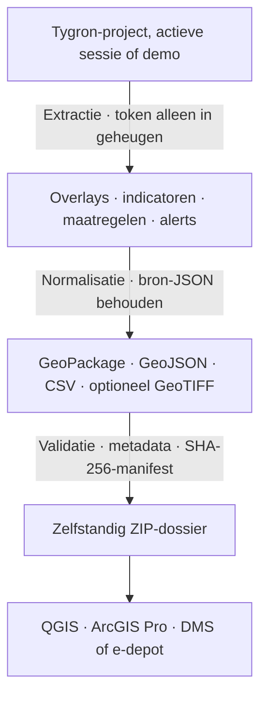

# Ontwerp en verantwoording

## Doel

ScenarioDossier maakt de inhoud en afwegingen van een doorgerekend Tygron-scenario raadpleegbaar nadat de Tygron-sessie
is beëindigd. Het prototype scheidt bronextractie, transformatie en presentatie zodat een FME-workspace of andere
opslagadapter later kan worden toegevoegd zonder het dossiermodel te wijzigen.

## Verwerkingsketen

## Keuzes

**GeoPackage als primaire container.** Eén open OGC-gebaseerd bestand kan vectorlagen en niet-ruimtelijke tabellen bij
elkaar houden en wordt door QGIS en ArcGIS Pro gelezen. GeoJSON en CSV dienen als eenvoudige fallback, GeoTIFF bewaart
raster resultaten.

**Bron en afleiding naast elkaar.** Tygron-datamodellen zijn rijk en kunnen wijzigen. Velden zoals naam, status, waarde
en beschrijving worden voor GIS-gebruik genormaliseerd, terwijl ieder record ook onverkort in `bron/*.json` en als
`source_json` behouden blijft.

**Integriteit, niet alleen transport.** Een SHA-256-manifest detecteert latere wijzigingen. `dossier.json` registreert
context, tijd, softwareversie, CRS, component aantallen en vrije besluit toelichting. Dit ondersteunt reproduceerbaarheid,
maar is geen digitale handtekening.

**Projectselectie zonder wachtwoordopslag.** De root-API-route gebruikt tijdelijk een gebruikersnaam en login key om
startbare projecten te tonen en de gekozen actieve versie te starten en joinen. De sessie wordt na de handeling
gesloten. De actieve-sessieroute accepteert daarnaast een tijdelijk API-token. Geen van deze geheimen komt in log of
dossier terecht.

**Technische poort voor download.** Voor het ZIP-bestand wordt aangeboden, worden verplichte metadata, bron-JSON, CSV,
eventuele GeoJSON en alle GeoPackage-tabellen gecontroleerd. Het rapport wordt als `metadata/validatierapport.json`
gearchiveerd.

**Gestructureerd dossierpaspoort.** Referentie, eigenaar, opsteller, besluitdatum en -status, alternatieven,
classificatie en bewaartermijn worden als afzonderlijke velden vastgelegd. De vrije toelichting blijft daarnaast
beschikbaar als inhoudelijke onderbouwing.

**Raadpleegbaar zonder GIS.** Ieder dossier bevat `rapport/dossierrapport.html`, een zelfstandig en afdrukbaar overzicht
van context, besluitvorming, componentaantallen, indicatoren, maatregelen, alerts en technische overdrachtsinformatie.

**Controle zonder Tygron.** Een bestaand ZIP-dossier kan opnieuw worden aangeboden aan de controlepagina. Veilige
tijdelijke extractie, inhoudsvalidatie en verificatie van alle SHA-256-hashes leveren een zelfstandig oordeel op zonder
toegang tot de oorspronkelijke Digital Twin.

**Lokale ruimtelijke preview.** MapLibre rendert measures en alerts als afzonderlijk schakelbare punt-, lijn- en
vlaklagen. De viewer gebruikt bij voorkeur de lokaal beheerde OpenMapTiles-stijl, maar valt terug op een neutrale kaart
zonder de scenario-objecten te verbergen. Daarmee blijft controle mogelijk wanneer de tileserver of het netwerk
tijdelijk niet beschikbaar is.

**Zonder runtime-afhankelijkheden.** Het prototype gebruikt alleen de Python-standaardbibliotheek. Dat verlaagt de
drempel voor demonstratie en overdracht. Een productievariant kan GDAL/FME gebruiken voor aanvullende
CRS-transformaties, validatie en formaten.

## Functionele dekking

| Eis                         | Prototype                                                                                           |
|-----------------------------|-----------------------------------------------------------------------------------------------------|
| Project/scenario selecteren | Root-API-projectlijst met actieve versie, keuzelijsten in demo, bevestigde namen bij actieve sessie |
| Overlays                    | Metadata/legenda in JSON, CSV, GPKG, live GeoTIFF-poging                                            |
| Indicators                  | JSON, CSV en GPKG-attributentabel                                                                   |
| Measures                    | Interactieve preview. JSON, CSV, GPKG en GeoJSON wanneer geometrie beschikbaar is                   |
| Alerts                      | Interactieve preview. Demo-objecten en live waarschuwingvelden/panel-attenties                      |
| OpenMapTiles                | Lokale basiskaart via configureerbare style-URL. Neutrale offline fallback                          |
| Duurzame opslag             | ZIP met open formaten, metadata, validatierapport en checksums                                      |
| QGIS/Esri                   | Stapsgewijze werkinstructie                                                                         |
| Dossiercontext              | Gestructureerd dossierpaspoort en besluitgegevens                                                   |
| Raadplegen zonder GIS       | Zelfstandig HTML-dossierrapport                                                                     |
| Latere controle             | ZIP-upload met structuur-, GeoPackage- en SHA-256-validatie                                         |
| Demonstratie                | Volledig offline demospoor in browserinterface                                                      |

## Relatie met SDG 3

De demonstratie maakt gezondheid expliciet meetbaar via hittestress, nabijheid van groen, actieve mobiliteit en
zorgvoorzieningen. De archieffunctie zorgt dat onderliggende maatregelen en indicatorwaarden later opnieuw kunnen worden
beoordeeld. De techniek bewijst niet op zichzelf een gezondheidseffect, daarvoor blijven bronkwaliteit,
indicator-definities en inhoudelijke validatie noodzakelijk.

## Productieroute

1. Spreek een canoniek dossierschema en verplichte metadata af met informatiebeheer, GIS-beheer en archiefspecialisten.
2. Maak per Tygron measuretype aanvullende adapters voor projectspecifieke attributen en valideer CRS en geometrie
   desgewenst met GDAL.
3. Archiveer overlaylegenda, tijdframes, rekencelgrootte, WMS/WCS-configuratie en relevante modelversies expliciet
   wanneer deze als formele archiefeis worden vastgesteld.
4. Voeg exports naar een beheerd DMS/e-depot toe met zaak-/project-ID, classificatie, bewaartermijn en autorisatie.
5. Voer de acceptatietest uit met representatieve provinciale projecten en de beheerde versies van QGIS en ArcGIS Pro.
6. Voer privacy-, security- en recordsmanagementbeoordelingen uit vóór productiegebruik.
