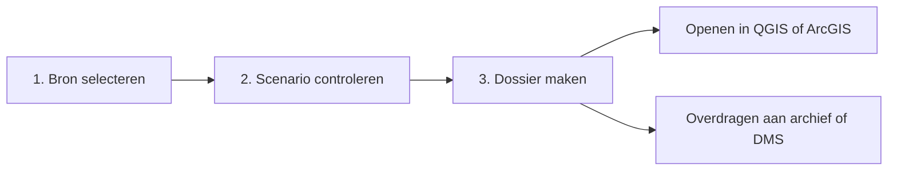
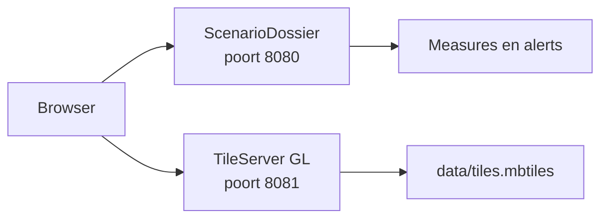

# Werkinstructie ScenarioDossier



## 1. Een dossier maken

Start de toepassing met `python3 app.py` en open `http://127.0.0.1:8080`.

### Demonstratie

1. Kies **Demonstratie**.
2. Selecteer een project en scenario.
3. Klik **Verbinding controleren**.
4. Controleer aantallen en kaartpreview.
   - Gebruik **Maatregelen** en **Alerts** om de kaartlagen afzonderlijk te tonen of verbergen.
   - Klik een punt, lijn of vlak voor naam, status en toelichting.
   - Zoek in **Onderdelen in dossier** op naam, type of status.
   - Vink afzonderlijke overlays, indicatoren, maatregelen en alerts aan of uit. De teller toont hoeveel records in het dossier komen; uitgesloten ruimtelijke records verdwijnen direct van de kaart.
   - Klik op de naam van een ruimtelijk record om de kaart daarop te centreren. Een uitgevinkt object wordt daarbij automatisch geselecteerd. **Alles** en **Geen** passen de volledige selectie in één keer aan.
   - **OpenMapTiles actief** betekent dat de lokale basiskaart geladen is. Bij **Basiskaart niet actief** blijven de scenario-objecten zichtbaar op een neutrale achtergrond.
5. Noteer bij **Toelichting en gemaakte afwegingen** de inhoudelijke onderbouwing van de keuze.
6. Open **Dossierpaspoort** en controleer referentie, eigenaar, opsteller, besluitdatum, besluitstatus, alternatieven, classificatie en bewaartermijn.
7. Controleer de individuele selectie in **Onderdelen in dossier** en kies **Dossier maken**. Alleen de aangevinkte records worden naar JSON, CSV, GeoJSON, GeoPackage, rapport en eventuele rasterexport geschreven.
8. Download het ZIP-bestand en draag het over aan de aangewezen dossierlocatie.

### Lokale OpenMapTiles-basiskaart installeren

OpenMapTiles is optioneel: exporteren, valideren en selecteren blijven zonder basiskaart werken. Een lokale basiskaart maakt het wel veel eenvoudiger om de ligging van measures en alerts te controleren. MapLibre zit al in ScenarioDossier; alleen de kaarttegels en de lokale tileserver moeten apart worden ingericht.



#### 1. Benodigdheden installeren

Installeer voordat je begint:

- **Docker Desktop** op macOS of Windows, of Docker Engine op Linux;
- **Docker Compose v2** (`docker compose`);
- **Git**, **Make** en **Bash**;
- minimaal ongeveer 15 GB vrije schijfruimte en bij voorkeur 8 GB werkgeheugen voor een kleine extract.

Start Docker Desktop en controleer in een terminal:

```bash
docker --version
docker compose version
docker info
git --version
make --version
```

Alle opdrachten moeten zonder foutmelding eindigen. Gebruik op Windows bij voorkeur WSL2 en bewaar OpenMapTiles in het Linux-bestandssysteem, bijvoorbeeld onder `/home/<gebruiker>`, niet onder `/mnt/c`.

#### 2. OpenMapTiles naast ScenarioDossier plaatsen

De commando's in deze handleiding gaan uit van twee naast elkaar gelegen mappen:

```text
INNO/
├── project/          ScenarioDossier
└── openmaptiles/     OpenMapTiles
```

Ga vanuit de projectmap één niveau omhoog en clone OpenMapTiles:

```bash
cd ..
git clone https://github.com/openmaptiles/openmaptiles.git
cd openmaptiles
```

Bestaat de map `openmaptiles` al, voer `git clone` dan niet opnieuw uit en ga direct naar die map.

#### 3. Detailniveau instellen

Open `openmaptiles/.env` en controleer deze waarden:

```dotenv
MIN_ZOOM=0
MAX_ZOOM=14
MBTILES_FILE=tiles.mbtiles
```

Zoomniveau 14 is nodig om straten en gebouwen in een gebiedsontwikkeling goed te kunnen herkennen. Gebruik dit alleen voor een kleine extract. Een volledige Nederlandse tegelset tot zoomniveau 14 vraagt veel meer verwerkingstijd en opslag. Bouw desgewenst eerst met `MAX_ZOOM=12` als snelle proef.

#### 4. Utrecht-data downloaden en tegels maken

De aanbevolen route voor de demo en Utrechtse projecten gebruikt de compacte Utrecht-extract van BBBike:

```bash
./quickstart.sh Utrecht bbbike
```

Dit proces downloadt Docker-images en OpenStreetMap-data, bouwt de database en schrijft uiteindelijk:

```text
openmaptiles/data/tiles.mbtiles
```

De eerste run kan lang duren. Laat de terminal open en voorkom dat de computer in slaapstand gaat. De voortgang en eventuele foutmelding staan ook in `openmaptiles/quickstart.log`.

Let op: `quickstart.sh` ruimt binnen de OpenMapTiles-installatie een eerdere database en het bestaande bestand met de naam uit `MBTILES_FILE` op. Kopieer een bestaande tegelset eerst naar een veilige locatie wanneer die bewaard moet blijven.

Voor scenario's buiten de Utrecht-extract zijn er twee mogelijkheden:

- kies een eigen rechthoek of polygoon via de BBBike-extractservice en plaats het `.osm.pbf`-bestand in `openmaptiles/data/`;
- gebruik `./quickstart.sh netherlands geofabrik` voor Nederland en verhoog `MAX_ZOOM` in kleine stappen.

Welke Geofabrik-gebieden beschikbaar zijn, is op te vragen met:

```bash
make list-geofabrik
```

#### 5. Bestaand MBTiles-bestand gebruiken

Is al een OpenMapTiles-compatibel MBTiles-bestand aangeleverd, dan hoeft stap 4 niet opnieuw. Plaats het bestand als:

```text
openmaptiles/data/tiles.mbtiles
```

De bestandsnaam moet overeenkomen met `MBTILES_FILE` in `.env` en met `/data/tiles.mbtiles` in `style/config.json`. Een willekeurig raster-MBTiles-bestand werkt niet: de meegeleverde stijl verwacht vectortegels volgens het OpenMapTiles-schema.

#### 6. De tileserver starten

Start de tileserver vanuit de map `openmaptiles`. Poort 8081 is bewust gekozen, omdat ScenarioDossier zelf poort 8080 gebruikt:

```bash
TPORT=8081 make start-tileserver
```

Open daarna deze adressen om de server te controleren:

- `http://127.0.0.1:8081/health`
- `http://127.0.0.1:8081/styles/OSM%20OpenMapTiles/style.json`

Of controleer vanuit de terminal:

```bash
curl --fail http://127.0.0.1:8081/health
curl --fail --output /dev/null http://127.0.0.1:8081/styles/OSM%20OpenMapTiles/style.json
```

De container blijft op de achtergrond draaien. Status en logs zijn op te vragen met:

```bash
docker compose ps tileserver-gl
docker compose logs --tail=100 tileserver-gl
```

Stoppen kan later met:

```bash
make stop-tileserver
```

In Windows PowerShell wordt een tijdelijke omgevingsvariabele anders gezet. Als Make buiten WSL beschikbaar is, gebruik dan:

```powershell
$env:TPORT="8081"
make start-tileserver
```

#### 7. ScenarioDossier starten en controleren

Open een tweede terminal, ga terug naar de map `project` en start de applicatie:

```bash
python3 app.py
```

Open `http://127.0.0.1:8080`, kies een bron en klik **Verbinding controleren**. In stap 2 hoort rechtsboven de melding **OpenMapTiles actief** te staan.

ScenarioDossier gebruikt standaard:

```text
http://127.0.0.1:8081/styles/OSM%20OpenMapTiles/style.json
```

Voor een andere host, poort of stijl start je ScenarioDossier zo:

```bash
OPENMAPTILES_STYLE_URL="http://kaartserver:8081/styles/eigen-stijl/style.json" python3 app.py
```

#### Problemen oplossen

| Melding of probleem | Waarschijnlijke oorzaak | Oplossing |
|---|---|---|
| **Basiskaart niet actief** | Tileserver is niet gestart, poort 8081 is bezet of de style-URL klopt niet | Test `/health`, bekijk `docker compose logs --tail=100 tileserver-gl` en controleer `OPENMAPTILES_STYLE_URL` |
| **Basiskaart dekt gebied niet** | De tileserver werkt, maar `tiles.mbtiles` bevat het scenario-gebied niet | Maak een extract die het volledige projectgebied omvat en herstart de tileserver |
| Kaart blijft grof bij inzoomen | `MAX_ZOOM` was te laag tijdens het genereren | Zet een hoger zoomniveau in `.env` en genereer `tiles.mbtiles` opnieuw |
| Alleen scenario-objecten op een egale achtergrond | De fallback werkt, maar de basiskaart niet | Controleer tileserver, stijl en browserconsole; exporteren kan wel doorgaan |
| Poort 8081 is al in gebruik | Een ander proces gebruikt dezelfde poort | Kies bijvoorbeeld `TPORT=8082` en start ScenarioDossier met een style-URL op poort 8082 |
| `exec format error` of container start niet | Docker-image en processorarchitectuur passen niet bij elkaar | Werk de OpenMapTiles-repository en Docker Desktop bij; schakel op Apple Silicon zo nodig x86/amd64-emulatie in |
| Quickstart stopt halverwege | Te weinig geheugen, opslag of een downloadfout | Controleer vrije ruimte, Docker-resources en `quickstart.log`; voer de quickstart daarna opnieuw uit |

De melding **Basiskaart dekt gebied niet** is nadrukkelijk anders dan **Basiskaart niet actief**: in het eerste geval draait de server wel, maar liggen de scenario-objecten buiten de begrenzing van het tegelbestand.

### Actieve Tygron-sessie

1. Open het juiste project/scenario in de Tygron Editor en wacht tot berekeningen gereed zijn.
2. Open **Tools > API Overview** en kopieer het API-token.
3. Kies in de toepassing **Tygron-sessie**.
4. Vul sessie-URL, API-token, projectnaam en scenarionaam in.
5. Voer stappen 3–8 uit de demonstratieroute uit.
6. Verwijder het token van het klembord en sluit de Tygron-sessie wanneer die niet meer nodig is.

Let op: de toepassing kan niet zelfstandig vaststellen welke bestuurlijke variant een geopende sessie representeert. Controleer project- en scenarionaam daarom met het projectteam.

### Project uit het Tygron-domein

1. Maak of verkrijg in Tygron een login key en behandel die als geheim.
2. Kies **Tygron-project**.
3. Vul Tygron-URL, gebruikersnaam en login key in. Het domein mag leeg blijven als het account dit teruggeeft.
4. Kies **Projecten laden**.
5. Selecteer een project. De toepassing toont de actieve projectversie die de Tygron start-API daadwerkelijk opent.
6. Kies **Verbinding controleren**, beoordeel de aantallen en maak het dossier.
7. De tijdelijke sessie wordt na controle of export automatisch gesloten. Wis de login key uit het formulier als de werkplek gedeeld wordt.

Gebruik de route met actieve sessie wanneer een specifieke, reeds geopende bestuurlijke variant moet worden vastgelegd. De projectroute opent de actieve projectversie.

## 2. Openen in QGIS

Getest conceptueel voor QGIS 3.x:

1. Pak het ZIP-dossier uit zonder de interne mappenstructuur te wijzigen.
2. Open QGIS en kies **Laag > Laag toevoegen > Vectorlaag toevoegen**.
3. Selecteer `gis/scenario.gpkg`.
4. Voeg de gewenste lagen/tabellen toe. `measures` en `alerts` kunnen geometrie bevatten; `overlays` en `indicators` zijn meestal tabellen.
5. Open de attributentabel om waarden, status, toelichting en het volledige `source_json` te bekijken.
6. Voeg eventuele bestanden uit `rasters/` toe via **Laag > Laag toevoegen > Rasterlaag toevoegen**.
7. Stel de symbologie in op `status`, `severity` of `value`. Sla eigen opmaak op in een apart QGIS-project; wijzig de bronbestanden in het dossier niet.
8. Vergelijk bij een steekproef het aantal objecten met `metadata/validatierapport.json`.

Alternatief: voeg de losse bestanden uit `gis/*.geojson` toe. Alle door het prototype gemaakte vectorgeometrie gebruikt WGS 84 (`EPSG:4326`).

## 3. Openen in ArcGIS Pro

1. Pak het ZIP-dossier uit.
2. Kies in het Catalog-paneel **Folders > Add Folder Connection** en selecteer de dossiermap.
3. Vouw `gis/scenario.gpkg` uit en sleep de feature classes en tabellen naar de kaart.
4. Voeg GeoTIFF-bestanden uit `rasters/` als rasterlaag toe.
5. Gebruik **Data > Export Features** alleen voor werkkopieën. Behoud het oorspronkelijke dossier ongewijzigd.

ArcGIS Online/Enterprise kan GeoJSON en CSV inlezen. Publiceer uitsluitend een gecontroleerde werkkopie en let op eventuele gevoelige attributen.

## 4. Integriteit controleren

### Via ScenarioDossier

1. Open `http://127.0.0.1:8080/controle` of kies **Dossier controleren** in de header.
2. Selecteer of sleep het oorspronkelijke ZIP-dossier naar het uploadvlak.
3. Kies **Dossier controleren**.
4. Controleer dat de uitkomst `Goedgekeurd` is en dat met name de controle `SHA-256-manifest` slaagt.

Het dossier wordt alleen tijdelijk voor de controle uitgepakt en niet door ScenarioDossier bewaard. Een uitkomst `Afgekeurd` betekent dat de inhoud onvolledig, gewijzigd of technisch onleesbaar is.

### Handmatig

Op macOS/Linux, vanuit de uitgepakte dossiermap:

```bash
shasum -a 256 -c metadata/manifest-sha256.txt
```

Op Windows PowerShell kan per regel `Get-FileHash -Algorithm SHA256 <bestand>` worden gebruikt. Een verschil betekent dat een bestand na export is gewijzigd of beschadigd. Het manifest controleert de inhoud van het dossier, behalve het manifest zelf.

De automatische inhoudscontrole staat in `metadata/validatierapport.json`. Een dossier wordt alleen aangeboden wanneer verplichte metadata, bronbestanden, CSV-bestanden, GeoJSON-bestanden en de vier GeoPackage-tabellen intern consistent zijn. Na uitpakken kan de controle opnieuw worden uitgevoerd vanuit de projectmap:

```bash
python3 -m scenario_dossier.validation /pad/naar/uitgepakt-dossier
```

## 5. Minimale dossiercontrole

Controleer vóór overdracht:

- project- en scenarionaam zijn eenduidig;
- dossierpaspoort, besluitstatus en bewaartermijn zijn ingevuld;
- exporttijd en bron staan in `metadata/dossier.json`;
- aantallen sluiten aan op de controlepagina;
- belangrijke afwegingen zijn vastgelegd;
- kaartlagen openen en staan op de verwachte locatie;
- rasterwaarschuwingen in `metadata/exportlog.json` zijn beoordeeld;
- `metadata/validatierapport.json` vermeldt `goedgekeurd`;
- het manifest valideert zonder fouten;
- `rapport/dossierrapport.html` opent in een browser en bevat de juiste afwegingen;
- bewaarlocatie, eigenaar en toegangsrechten zijn toegewezen.

## 6. Afbakening prototype

- Tygron-objectmodellen verschillen per overlay- en measuretype. De oorspronkelijke JSON blijft daarom altijd behouden naast de genormaliseerde velden.
- Alerts worden live afgeleid uit waarschuwingvelden en panel-attenties. Organisatiespecifieke alertbronnen kunnen als extra adapter worden toegevoegd.
- De 3D-scène en interactief gedrag worden niet gereconstrueerd. Het dossier archiveert resultaten, geometrie, indicatoren en context voor 2D-GIS.
- De ingebouwde validatie controleert technische structuur en aantallen. Een inhoudelijke steekproef in de actuele provinciale QGIS- en ArcGIS-omgeving blijft onderdeel van acceptatie.
- Duurzame bewaring is ook een organisatorisch proces. Dit prototype vervangt geen DMS/e-depot, selectielijst, autorisatiemodel of formeel informatiebeheer.
