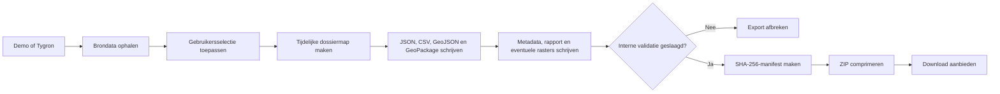

# Technische documentatie: opbouw van het ZIP-bestand

Dit document beschrijft hoe ScenarioDossier een selectie uit een demo of Tygron scenario omzet in een duurzaam
ZIP-bestand. De beschrijving volgt de implementatie in [`scenario_dossier/web.py`](../scenario_dossier/web.py), [
`scenario_dossier/exporter.py`](../scenario_dossier/exporter.py) en [
`scenario_dossier/validation.py`](../scenario_dossier/validation.py).

## 1. Overzicht

Het ZIP-bestand wordt niet rechtstreeks vanuit de brondata geschreven. ScenarioDossier bouwt eerst een complete
tijdelijke dossiermap, valideert die map en maakt vervolgens voor ieder dossierbestand een SHA-256-hash. Alleen een
goedgekeurde dossiermap wordt gecomprimeerd.



De centrale functie is `build_archive()` in [`scenario_dossier/exporter.py`](../scenario_dossier/exporter.py)

## 2. Start van de export

Wanneer de gebruiker in stap 2 op **Dossier maken** klikt, bouwt [`static/app.js`](../static/app.js) een JSON-verzoek
voor `POST /api/export`.

Dit verzoek bevat:

- De gekozen bron: `demo`, `tygron` of `tygron_project`.
- Project- en scenariogegevens.
- De aangevinkte componenten.
- De individueel geselecteerde records.
- De toelichting en gemaakte afwegingen.
- De velden uit het dossierpaspoort.
- De keuze om beschikbare overlayrasters op te halen.

De individuele selectie gebruikt keys in de vorm `id:<Tygron-id>`. Heeft een record geen ID, dan wordt binnen de
component `index:<positie>` gebruikt.

De vier vaste componenten zijn:

1. `overlays`
2. `indicators`
3. `measures`
4. `alerts`

De server accepteert maximaal 1.000.000 bytes JSON per verzoek. API-tokens en login keys worden gebruikt om de bron te
approachen, maar worden niet aan `build_archive()` doorgegeven.

## 3. Brondata ophalen en selecteren

`_resolve()` in [`scenario_dossier/web.py`](../scenario_dossier/web.py) bepaalt hoe de data wordt verkregen:

| Bron                  | Werkwijze                                                                                      |
|-----------------------|------------------------------------------------------------------------------------------------|
| Demonstratie          | Leest het gekozen scenario uit [`data/demo.json`](../data/demo.json)                           |
| Actieve Tygron-sessie | Gebruikt het ingevulde sessietoken om de componenten op te halen                               |
| Tygron-project        | Start en join het gekozen project tijdelijk, haalt de componenten op en sluit de sessie daarna |

De bronadapter levert vier lijsten en eventuele technische waarschuwingen op. `_select_data()` past daarna de selectie
uit de interface toe. Niet-aangevinkte componenten en records worden verwijderd voordat het dossier wordt opgebouwd.
Iedere component blijft wel als key bestaan, ook als de uiteindelijke lijst leeg is.

Deze filtering is bepalend voor alle vervolgformaten. De aantallen in JSON, CSV, GeoPackage, metadata en rapport zijn
daardoor gebaseerd op dezelfde selectie.

## 4. Bestandsnaam en tijdelijke werkmap

Bij aanvang wordt een UTC-tijdstip vastgelegd. De ZIP-naam krijgt dit patroon:

```text
<project>_<scenario>_YYYYMMDDTHHMMSSZ.zip
```

Project en scenarionaam worden door `slug()` omgezet naar kleine letters. Tekens buiten letters, cijfers, `_` en `-`
worden vervangen door een koppelteken. Iedere slug is maximaal 60 tekens en een lege naam wordt `scenario`.

Voorbeeld:

```text
merwedekanaalzone_groen-gezond-2040_20260907T121530Z.zip
```

De definitieve ZIP wordt in `exports/` geplaatst. De inhoud wordt eerst opgebouwd in een willekeurig aangemaakte
tijdelijke map met prefix `scenario-dossier-`. 

Daarin worden de volgende mappen aangemaakt:

```text
metadata/
bron/
gis/
tabellen/
rasters/
rapport/
```

De tijdelijke map wordt in een `finally`-blok verwijderd, zowel na een geslaagde export als na een fout.

## 5. Metadata opbouwen

`metadata/dossier.json` wordt als eerste geschreven. 

Het bevat onder andere:

- schema-ID `nl.provincie-utrecht.scenariodossier/1.0`
- project- en scenarionaam
- exportmoment in UTC
- brontype
- coördinatenstelsel `EPSG:4326`
- recordaantal per component
- toelichting en onderbouwing
- dossierhouder, opsteller, classificatie en bewaartermijn
- besluitdatum, besluitstatus en alternatieven
- softwareversie
- `token_archived: false`

Velden uit het dossierpaspoort worden witruimte aan begin en einde en verwijdert op 2.000 tekens. De algemene
toelichting wordt door de weblaag begrensd op 4.000 tekens.

Authenticatiegegevens worden niet in de metadata, exportlog of bronbestanden opgenomen.

## 6. Conversie per formaat

Voor iedere component worden dezelfde geselecteerde records naar meerdere vormen geconverteerd.

| Formaat    | Locatie                    | Doel                                                   |
|------------|----------------------------|--------------------------------------------------------|
| JSON       | `bron/<component>.json`    | Behoud van de ontvangen bronstructuur                  |
| CSV        | `tabellen/<component>.csv` | Snelle inspectie en gebruik in tabelsoftware           |
| GeoJSON    | `gis/<component>.geojson`  | Brede uitwisseling van records met geometrie           |
| GeoPackage | `gis/scenario.gpkg`        | Een gestandaardiseerd GIS-bestand met alle componenten |

### JSON

De geselecteerde lijst wordt als UTF-8 JSON met tabs geschreven. Ook voor een lege component wordt een
JSON-bestand met een lege lijst gemaakt.

### CSV

De CSV-kolommen zijn de alfabetisch gesorteerde verzameling van alle property names binnen de component. Samengestelde
waarden, zoals objecten en lijsten, worden als compacte JSON in een cel opgeslagen. De bestanden gebruiken UTF-8 met
BOM (`utf-8-sig`) om openen in spreadsheet software makkelijk te maken.

Een lege component krijgt een CSV met alleen de kolom `geen_records`. Hierdoor bestaat voor iedere component altijd een
niet leeg csv-bestand.

### GeoJSON

GeoJSON wordt alleen geschreven wanneer ten minste één geselecteerd record in de component geometrie bevat. Alleen de
ruimtelijke records komen in die FeatureCollection. Het bestand vermeldt CRS84; coördinaten worden als WGS
84-lengtegraad en -breedtegraad behandeld.

In de huidige brondata zijn vooral `measures` en `alerts` ruimtelijk. De exportcode ondersteunt ruimtelijke records
echter voor alle vier componenten.

### GeoPackage

`gis/scenario.gpkg` is een SQLite-based GeoPackage met vier tabellen:

```text
overlays
indicators
measures
alerts
```

Iedere tabel bevat de genormaliseerde velden:

| Veld          | Inhoud                                                               |
|---------------|----------------------------------------------------------------------|
| `fid`         | Automatisch volgnummer en primaire sleutel                           |
| `item_id`     | ID uit de bron, indien aanwezig                                      |
| `name`        | Naam of korte naam                                                   |
| `status`      | Status of ernst niveau                                               |
| `value`       | Waarde of huidige waarde                                             |
| `unit`        | Eenheid                                                              |
| `description` | Beschrijving of waarschuwingstekst                                   |
| `source_json` | Volledige properties als compacte JSON                               |
| `geom`        | GeoPackage-geometrie, wanneer de component ruimtelijke records bevat |

Wanneer minimaal één record in een component geometrie bevat, wordt de tabel als featuretable geregistreerd.
Niet-ruimtelijke records in dezelfde tabel krijgen dan `NULL` in `geom`. Zonder geometrie wordt de tabel als
attributentabel geregistreerd.

De geometrie wordt in WKB verpakt met een GeoPackage-header en SRS-ID 4326. Ondersteund zijn:

- Point en MultiPoint;
- LineString en MultiLineString;
- Polygon en MultiPolygon;
- GeometryCollection.

De oorspronkelijke properties blijven naast de genormaliseerde kolommen behouden in `source_json`.

## 7. Optionele GeoTIFF-rasters

Bij een live Tygron-export probeert ScenarioDossier voor iedere geselecteerde overlay met een numeriek ID een GeoTIFF op
te halen. De bestandsnaam krijgt deze vorm:

```text
rasters/overlay_<id>_<overlaynaam>.tif
```

Een mislukte rasterdownload breekt de export niet af. De fout wordt als waarschuwing toegevoegd aan
`metadata/exportlog.json` en het HTML-rapport. Bij de demonstratie is geen raster-fetcher aanwezig en blijft `rasters/`
leeg.

## 8. Rapport, exportlog en README

Na de GIS-bestanden worden drie ondersteunende bestanden gemaakt:

- `metadata/exportlog.json` bevat status `completed` en alle bron- en rasterwaarschuwingen.
- `rapport/dossierrapport.html` bevat een zelfstandig leesbaar dossierpaspoort, besluitinformatie, aantallen,
  indicatoren, maatregelen, alerts en exportmeldingen.
- `README.txt` bevat project, scenario, exportmoment en korte instructies voor het rapport, GeoPackage en manifest.

Het HTML-rapport heeft ingebedde CSS en heeft daarom geen bestanden uit ScenarioDossier of internet nodig om geopend te
worden.

## 9. Validatie voor compressie

Voordat hashes of een ZIP worden gemaakt, roept de exporter `validate_dossier_directory()` aan met
`check_manifest=False`. 

Deze eerste controle beoordeelt:

- aanwezigheid en verplichte velden van `metadata/dossier.json`.
- aanwezigheid van gestructureerde dossier- en besluitgegevens.
- leesbaarheid en recordaantallen van de vier bron-JSON-bestanden.
- aanwezigheid van de vier niet-lege CSV-bestanden.
- geldigheid van eventueel aanwezige GeoJSON FeatureCollections.
- de GeoPackage-header.
- aanwezigheid van de vier GeoPackage-tabellen.
- overeenkomst tussen GeoPackage-aantallen en metadata.
- aanwezigheid van het zelfstandige HTML-rapport.

Het resultaat wordt geschreven naar `metadata/validatierapport.json`. Als de status niet `goedgekeurd` is, werpt de
exporter een fout en wordt geen normale downloadrespons teruggegeven.

## 10. SHA-256-manifest

Na een geslaagde inhoudsvalidatie worden alle bestanden recursief en in gesorteerde padvolgorde gelezen. Van ieder
bestand wordt een SHA-256-hash gemaakt. De regels in `metadata/manifest-sha256.txt` hebben deze vorm:

```text
<64-teken-hash><twee spaties><relatief/bestandspad>
```

Voorbeeld:

```text
6f8a...  gis/scenario.gpkg
```

Het manifest bevat ook de hash van `metadata/validatierapport.json`, maar niet van zichzelf. Bij een latere controle
wordt zowel nagegaan of iedere hash klopt als of de verzameling bestanden exact overeenkomt met het manifest. Een
toegevoegd, verwijderd of gewijzigd bestand leidt daardoor tot afkeuring.

## 11. ZIP maken en aanbieden

Pas na validatie en manifestgeneratie wordt de definitieve ZIP gemaakt met Python `zipfile` en compressiemethode
`ZIP_DEFLATED`. Alle gewone bestanden uit de tijdelijke werkmap worden in gesorteerde volgorde toegevoegd. In het
ZIP-bestand staan uitsluitend relatieve paden; de naam van de tijdelijke map wordt niet opgenomen.

De API antwoordt met HTTP-status `201 Created` en geeft terug:

- `filename`: de gemaakte bestandsnaam;
- `download`: het lokale downloadpad;
- `summary`: metadata, waarschuwingen, validatiestatus en ZIP-grootte.

De browser gebruikt daarna `/api/download/<bestandsnaam>`. De server reduceert dit verzoek tot alleen de bestandsnaam,
accepteert uitsluitend bestaande `.zip`-bestanden uit `exports/` en levert die als `application/zip`.

## 12. Verwachte ZIP-structuur

```text
project_scenario_YYYYMMDDTHHMMSSZ.zip
├── README.txt
├── metadata/
│   ├── dossier.json
│   ├── exportlog.json
│   ├── validatierapport.json
│   └── manifest-sha256.txt
├── rapport/
│   └── dossierrapport.html
├── bron/
│   ├── overlays.json
│   ├── indicators.json
│   ├── measures.json
│   └── alerts.json
├── gis/
│   ├── scenario.gpkg
│   ├── overlays.geojson       alleen indien ruimtelijk
│   ├── indicators.geojson     alleen indien ruimtelijk
│   ├── measures.geojson       alleen indien ruimtelijk
│   └── alerts.geojson         alleen indien ruimtelijk
├── tabellen/
│   ├── overlays.csv
│   ├── indicators.csv
│   ├── measures.csv
│   └── alerts.csv
└── rasters/
    └── overlay_<id>_<naam>.tif    nul of meer bestanden
```

Lege mappen worden door de huidige ZIP-opbouw niet als afzonderlijk ZIP-lid toegevoegd. Daardoor kan `rasters/` na
uitpakken ontbreken wanneer geen GeoTIFF is geëxporteerd.

## 13. Onafhankelijke controle na export

De pagina `/controle` voert een tweede validatieronde uit op een aangeleverd ZIP-bestand. Hierbij gelden aanvullende
veiligheidsgrenzen:

- maximale uploadgrootte: 200 MB;
- maximaal 5.000 ZIP-leden;
- maximaal 1 GB totale ongecomprimeerde inhoud;
- absolute paden en paden met `..` worden geweigerd;
- het bestand moet technisch een geldige ZIP zijn.

Na padveilige extractie in een tijdelijke map wordt dezelfde dossiercontrole uitgevoerd, nu inclusief het
SHA-256-manifest. De tijdelijke controlemap wordt daarna automatisch verwijderd. Het geüploade origineel wordt niet door
ScenarioDossier gewijzigd of permanent opgeslagen.

## 14. Privacy, beheer en beperkingen

- API-token, client-token, login key en wachtwoord worden niet gearchiveerd.
- Requestbodies worden niet naar het serverlog geschreven.
- De gemaakte ZIP blijft wel in de lokale map `exports/` staan totdat deze beheerd of verwijderd wordt.
- De export is een momentopname; latere wijzigingen in Tygron veranderen een bestaand dossier niet.
- Het GeoPackage gebruikt EPSG:4326 en bevat geen vooraf opgebouwde ruimtelijke index.
- De interactieve Tygron-3D-scène wordt niet gereconstrueerd.
- De automatische controle bewijst technische consistentie en integriteit, niet de inhoudelijke juistheid van het
  besluit.
- ZIP-bestanden zijn door tijdstempels en ZIP-metadata niet bedoeld als byte-voor-byte reproduceerbare builds.

## 15. Implementatie controleren

Voer vanuit de projectmap alle geautomatiseerde tests uit:

```bash
python3 -m unittest discover -s tests -v
```

De belangrijkste exporttests staan in `tests/test_exporter.py` en controleren onder andere:

- volledigheid en geldigheid van een normaal dossier;
- recordaantallen en geometrie in het GeoPackage;
- juistheid van iedere SHA-256-hash;
- afkeuring na wijziging van een dossierbestand;
- blokkering van onveilige ZIP-paden;
- lege componenten;
- GeometryCollection;
- exporteerbaarheid van ieder demonstratiescenario.

De individuele recordselectie wordt getest in `tests/test_web.py`.
