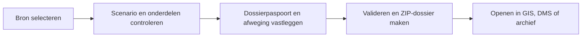
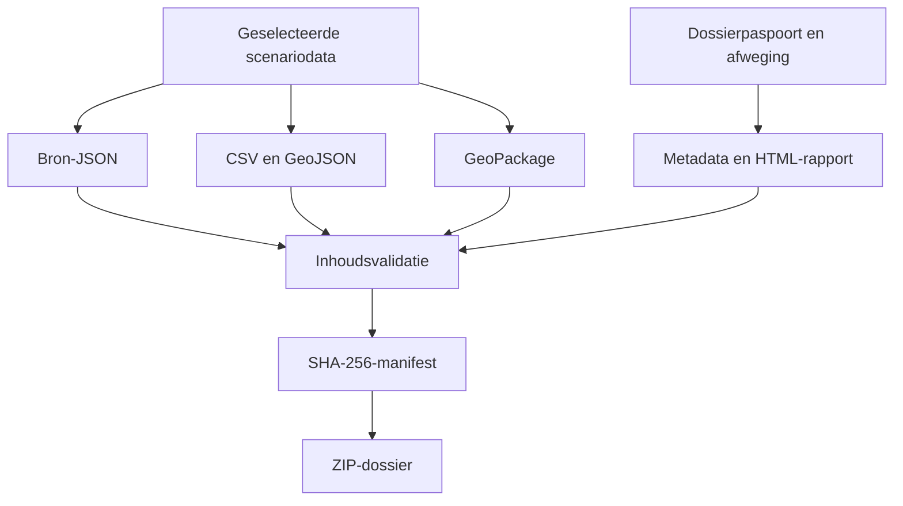

# Verantwoordingsdocument

**Gilde:** Iteratie 2 – Verantwoording keuzes  
**Student:** Hugo de Heus  
**Studentnummer:** 1852688  
**Project:** Dossiervorming Digitale Scenario's vanuit Digital Twin  
**Opdrachtgever:** Provincie Utrecht  
**Documentstatus:** Reviewconcept voor gilde 2 – feedback van twee reviewers nog toevoegen  
**Datum:** 21 september 2026

## Inhoudsopgave

* [1. Inleiding](#1-inleiding)
    * [1.1 Leeswijzer](#11-leeswijzer)
    * [1.2 Versiebeheer](#12-versiebeheer)
* [2. Projectoriëntatie](#2-projectoriëntatie)
    * [2.1 Organisatorische context en situatie](#21-organisatorische-context-en-situatie)
    * [2.2 Van situatie naar probleem](#22-van-situatie-naar-probleem)
    * [2.3 Gewenste oplossing](#23-gewenste-oplossing)
    * [2.4 Productdoel en afbakening](#24-productdoel-en-afbakening)
    * [2.5 Team, rollen en stakeholders](#25-team-rollen-en-stakeholders)
    * [2.6 Relatie met SDG 3: Goede gezondheid en welzijn](#26-relatie-met-sdg-3-goede-gezondheid-en-welzijn)
* [3. Verantwoording van gemaakte keuzes met MCDA](#3-verantwoording-van-gemaakte-keuzes-met-mcda)
    * [3.1 Werkwijze en rekenregel](#31-werkwijze-en-rekenregel)
    * [3.2 Stakeholderbelangen achter de gewichten](#32-stakeholderbelangen-achter-de-gewichten)
    * [3.3 MCDA 1 – ETL-technologie](#33-mcda-1--etl-technologie)
    * [3.4 MCDA 2 – Primair dossierformaat](#34-mcda-2--primair-dossierformaat)
    * [3.5 MCDA 3 – Basiskaart voor de ruimtelijke controle](#35-mcda-3--basiskaart-voor-de-ruimtelijke-controle)
    * [3.6 Nadelen, onverwachte uitkomst en verantwoordelijkheid](#36-nadelen-onverwachte-uitkomst-en-verantwoordelijkheid)
    * [3.7 Mitigatie en besluitstatus](#37-mitigatie-en-besluitstatus)
* [4. Verantwoording van opgeleverd werk](#4-verantwoording-van-opgeleverd-werk)
    * [4.1 Criteria voor de beroepsproducten](#41-criteria-voor-de-beroepsproducten)
    * [4.2 Toepassing van curriculumkennis](#42-toepassing-van-curriculumkennis)
    * [4.3 Bewijs en actuele status](#43-bewijs-en-actuele-status)
* [5. Deep-dive: een duurzaam en controleerbaar GIS-dossier](#5-deep-dive-een-duurzaam-en-controleerbaar-gis-dossier)
    * [5.1 Onderwerp](#51-onderwerp)
    * [5.2 Uitdieping](#52-uitdieping)
    * [5.3 Eerste conclusies](#53-eerste-conclusies)
    * [5.4 Plan voor de presentatie](#54-plan-voor-de-presentatie)
* [6. Peerreview en voorbereiding op gilde 2](#6-peerreview-en-voorbereiding-op-gilde-2)
    * [6.1 Reviewplanning en status](#61-reviewplanning-en-status)
    * [6.2 Ontvangen feedback en verwerking](#62-ontvangen-feedback-en-verwerking)
        * [Reviewer 1 – [naam invullen]](#reviewer-1--naam-invullen)
        * [Reviewer 2 – [naam invullen]](#reviewer-2--naam-invullen)
    * [6.3 Omgaan met tegengestelde feedback](#63-omgaan-met-tegengestelde-feedback)
    * [6.4 Inbreng voor de discussie](#64-inbreng-voor-de-discussie)
    * [6.5 Gewenst professioneel gedrag](#65-gewenst-professioneel-gedrag)
* [7. Vervolgacties voor iteratie 3](#7-vervolgacties-voor-iteratie-3)
* [8. Bronnen en betrouwbaarheid](#8-bronnen-en-betrouwbaarheid)
* [9. Bewijsregister binnen dit document](#9-bewijsregister-binnen-dit-document)

<!-- TOC -->

## 1. Inleiding

Dit verantwoordingsdocument beschrijft hoe ik de opdracht van de Provincie Utrecht heb geïnterpreteerd, welke oplossing
ik voorstel en op basis van welke criteria ik de eerste technische keuzes heb gemaakt. Het document is zelfstandig
leesbaar. De relevante opdrachtcontext, ontwerpkeuzes, procesbeschrijving, testresultaten en bewijsverwijzingen zijn
daarom in dit document zelf opgenomen.

Voor de tweede gildesessie ligt de nadruk op het herleidbaar verantwoorden van keuzes. Ik gebruik daarvoor
Multi-Criteria Decision Analysis (MCDA): alternatieven worden aan dezelfde criteria getoetst, criteria krijgen een
gemotiveerd gewicht en scores worden gekoppeld aan bronnen, projectevidence en stakeholderbelangen. Daarnaast leg ik
mijn deep-divekeuze voor iteratie 4 vast.

### 1.1 Leeswijzer

- Hoofdstuk 2 beschrijft de projectoriëntatie.
- Hoofdstuk 3 verantwoordt drie belangrijke keuzes met MCDA.
- Hoofdstuk 4 koppelt het opgeleverde werk aan toetsbare criteria.
- Hoofdstuk 5 bevat de eerste deep-dive.
- Hoofdstuk 6 bevat het peerreviewproces en de verwerking van feedback.
- Hoofdstuk 8 maakt de gebruikte informatie herleidbaar.

### 1.2 Versiebeheer

| Versie | Datum      | Iteratie | Wijziging                                                                                                                                                       |
|--------|------------|----------|-----------------------------------------------------------------------------------------------------------------------------------------------------------------|
| 0.1    | 21-09-2026 | Gilde 1  | Eerste versie met projectoriëntatie, SDG-koppeling, keuzeverantwoording, beroepsproducten, deep-dive en actuele kwaliteitsbevinding                             |
| 0.2    | 21-09-2026 | Gilde 2  | Gewogen MCDA voor ETL, dossierformaten en basiskaart. Stakeholderconflicten, gevoeligheidsanalyse, bronnenregister, deep-diveplan en reviewformulier toegevoegd |

Het project zelf gebruikt Git. De repository bevat commits vanaf 7 september 2026. Dit document wordt vanaf deze versie
meegeleverd als projectbewijs.

## 2. Projectoriëntatie

### 2.1 Organisatorische context en situatie

De Provincie Utrecht ondersteunt gemeenten bij gebiedsontwikkeling. Hiervoor wordt de Digital Twin-omgeving van Tygron
gebruikt. In Tygron kunnen scenario's worden doorgerekend en beoordeeld met onder andere kaartlagen, indicatoren,
maatregelen en meldingen. De interactieve omgeving is bruikbaar tijdens een actief project en vereist een licentie.

De informatie heeft ook na beëindiging van een Tygron-project waarde. Beleidsmedewerkers, GIS-specialisten,
informatiebeheerders en betrokken gemeenten moeten later kunnen reconstrueren:

- Welk scenario is beoordeeld.
- Welke resultaten en kaartobjecten daarbij hoorden.
- Welke onderdelen uiteindelijk zijn geselecteerd.
- Welke afwegingen en besluitcontext zijn vastgelegd.
- Of het overgedragen dossier na export nog compleet en ongewijzigd is.

Deze opdrachtomschrijving vormt het uitgangspunt voor de probleemanalyse, de ontwerpkeuzes en de beoordeling van het
prototype in de volgende hoofdstukken.

### 2.2 Van situatie naar probleem

De Tygron 3D-viewer is gekoppeld aan een actief Tygron-project. Wanneer het project niet meer actief of toegankelijk is,
is deze viewer geen onafhankelijke archiefvoorziening. Alleen een schermafbeelding of een losse data-export is ook
onvoldoende, daarmee ontbreken: structuur, samenhang, besluitcontext en een controle op volledigheid.

Het kernprobleem is daarom:

> Hoe kan de Provincie Utrecht de relevante inhoud en gemaakte afwegingen van een Tygron-scenario duurzaam,
> controleerbaar en GIS-geschikt bewaren, zodat deze informatie ook zonder actieve Tygron-omgeving geraadpleegd kan
> worden?

Het probleem bestaat uit vijf deelproblemen:

1. De gebruiker moet het juiste project en scenario kunnen selecteren.
2. Tygron-componenten moeten worden opgehaald en getransformeerd.
3. Ruimtelijke en niet-ruimtelijke gegevens moeten duurzaam worden verpakt.
4. Keuzes en metadata moeten naast technische data worden vastgelegd.
5. Het dossier moet later zonder Tygron gecontroleerd en geopend kunnen worden.

### 2.3 Gewenste oplossing

Mijn productvisie is een taakgerichte webapplicatie waarmee een gebruiker in drie herkenbare stappen een zelfstandig
scenariodossier maakt:



Het beoogde dossier bevat open en breed ondersteunde formaten: GeoPackage, GeoJSON, CSV, JSON, optioneel GeoTIFF en een
zelfstandig HTML-rapport. Metadata, een validatierapport en SHA-256-hashes maken de overdracht controleerbaar.

### 2.4 Productdoel en afbakening

Het productdoel voor het prototype is:

> Een gebruiker kan een demo, actieve Tygron-sessie of startbaar Tygron-project selecteren, de relevante onderdelen
> controleren, een onderbouwde selectie maken en een zelfstandig GIS-dossier downloaden en opnieuw valideren.

Binnen de huidige scope vallen:

- Selectie van project, scenario en individuele onderdelen.
- Verwerking van overlays, indicatoren, measures en alerts.
- Een ruimtelijke 2D-preview.
- Export naar open GIS- en tabelformaten.
- Dossiermetadata, besluitonderbouwing en een leesbaar rapport.
- Technische validatie en integriteitscontrole.
- Een werkinstructie voor QGIS en ArcGIS Pro.

Buiten de scope van het prototype vallen:

- Reconstructie van de volledige interactieve Tygron 3D-scene.
- Formele opname in een provinciaal DMS of e-depot.
- Een definitief autorisatie- en bewaarbeleid.
- Inhoudelijke garantie dat een scenario of besluit beleidsmatig juist is.
- Volledige ondersteuning van ieder projectspecifiek Tygron objecttype.

### 2.5 Team, rollen en stakeholders

Ik werk als student aan het ontwerp, de implementatie, de tests en de documentatie van het prototype. Binnen het project
vervul ik daardoor voorlopig meerdere rollen: informatieanalist, ontwerper, Python-ontwikkelaar, GIS-ontwikkelaar en
tester.

De voorlopige stakeholderanalyse is:

| Stakeholder                      | Belang                                                     | Betrokkenheid bij validatie                   |
|----------------------------------|------------------------------------------------------------|-----------------------------------------------|
| Provincie Utrecht, opdrachtgever | Duurzame beschikbaarheid en overdraagbaarheid              | Eisen, prioriteiten en acceptatie bevestigen  |
| GIS-specialisten                 | Correcte geometrie en bruikbaarheid in QGIS/ArcGIS         | GeoPackage, GeoJSON, CRS en symbologie testen |
| Informatiebeheer en archief      | Context, integriteit, bewaartermijn en dossiervorming      | Dossierschema en metadata beoordelen          |
| Gemeenten en projectteams        | Resultaten en keuzes later begrijpelijk raadplegen         | Gebruiksgemak en rapport beoordelen           |
| Tygron-beheerder                 | Veilige en juiste toegang tot projectdata                  | API-route en sessiegedrag controleren         |
| Docent en medestudenten          | Kwaliteit van verantwoording en professionele ontwikkeling | Gilde-observaties en peerreviews              |

Deze rollen zijn een eerste analyse. Ik moet in een volgende iteratie nog expliciet laten bevestigen wie formeel
eigenaar, gebruiker en acceptant van het dossier is.

### 2.6 Relatie met SDG 3: Goede gezondheid en welzijn

De opdracht noemt SDG 3. De relatie zit niet alleen in de techniek, maar vooral in de inhoud die met het dossier
behouden kan blijven. In gebiedsontwikkeling kunnen scenario's bijvoorbeeld hittestress, bereikbaarheid van groen,
actieve mobiliteit, geluid, luchtkwaliteit en zorgvoorzieningen bevatten.

Mijn ontwerpkeuzes ondersteunen SDG 3 als volgt:

- Gezondheidsindicatoren blijven na afloop van de Tygron-sessie raadpleegbaar.
- Maatregelen en indicatorwaarden worden samen met de scenario en besluitcontext bewaard.
- Verschillende scenario's kunnen later inhoudelijk worden vergeleken op een werkkopie.
- Open GIS-formaten maken hergebruik door andere professionals mogelijk.
- Een manifest helpt aantonen dat de onderliggende bestanden sinds overdracht niet ongemerkt zijn gewijzigd.

De applicatie bewijst zelf geen gezondheidseffect. De betekenis van een indicator, bronkwaliteit en beleidsmatige
interpretatie blijven de verantwoordelijkheid van domeinexperts. In een volgende iteratie wil ik daarom laten beoordelen
welke gezondheidsindicatoren en gegevens minimaal in een formeel dossier moeten staan.

## 3. Verantwoording van gemaakte keuzes met MCDA

### 3.1 Werkwijze en rekenregel

MCDA is hier beslisondersteuning en geen automatische waarheid. Ik heb per beslissing eerst de alternatieven afgebakend,
daarna criteria en gewichten bepaald, ieder alternatief op een schaal van 1 tot en met 5 beoordeeld en tenslotte de
uitkomst geïnterpreteerd. De aanpak sluit aan bij de stappen uit
de [MCDA-handleiding van de Britse overheid](https://www.gov.uk/government/publications/multi-criteria-analysis-manual-for-making-government-policy).

De gewichten tellen per MCDA op tot 100%. De gewogen totaalscore loopt van 0 tot 100 en wordt als volgt berekend:

```text
gewogen totaalscore = som(gewicht × score / 5)
```

De scores betekenen:

| Score | Betekenis                                         |
|------:|---------------------------------------------------|
|     1 | Voldoet nauwelijks of brengt een groot risico mee |
|     2 | Voldoet beperkt                                   |
|     3 | Voldoet voldoende, maar met duidelijke nadelen    |
|     4 | Voldoet goed                                      |
|     5 | Voldoet zeer goed en is met bewijs onderbouwd     |

De cijfers zijn gebaseerd op de opdracht, officiële standaarden en documentatie, project evidence en mijn voorlopige
stakeholderanalyse. Waar nog geen stakeholderbevestiging bestaat, benoem ik dit als aanname. Daarmee voorkom ik dat een
exact getal meer zekerheid suggereert dan de beschikbare informatie toelaat.

### 3.2 Stakeholderbelangen achter de gewichten

De criteria zijn niet neutraal: stakeholders leggen verschillende accenten.

| Stakeholder                       | Zwaarwegend belang                                   | Mogelijk conflict                                                                   |
|-----------------------------------|------------------------------------------------------|-------------------------------------------------------------------------------------|
| Beleidsmedewerker of gemeente     | Eenvoudig selecteren en later begrijpen              | Wil weinig technische stappen, terwijl dossiervorming extra metadata vraagt         |
| GIS-specialist                    | Correcte geometrie en brede GIS-ondersteuning        | Kan rijkere formaten verkiezen die voor niet-GIS-gebruikers minder transparant zijn |
| Informatiebeheerder of archivaris | Openheid, context, integriteit en bewaarbeleid       | Duurzaamheid kan extra werk en strengere invoer vragen                              |
| Provinciaal IT-beheer             | Security, beheerbaarheid en ondersteunde technologie | Centrale beheersbaarheid kan botsen met snelle lokale prototyping                   |
| Projectteam en student            | Snel een aantoonbaar prototype opleveren             | Korte doorlooptijd mag productie-eisen niet onzichtbaar maken                       |

Bij de formaatkeuze wegen duurzame toegankelijkheid en GIS-interoperabiliteit daarom samen 55%. Bij de ETL-keuze weegt
technische GIS-capaciteit zwaar, maar krijgen licentie-onafhankelijkheid, beheerbaarheid en testbaarheid samen meer
gewicht. Bij de kaartkeuze wegen privacy en offline beschikbaarheid samen 50%, omdat scenario-informatie niet
afhankelijk moet worden van een publieke kaartdienst.

### 3.3 MCDA 1 – ETL-technologie

**Beslissing:** waarmee worden extractie, transformatie, validatie en verpakking gerealiseerd?

| Criterium                                         | Gewicht | Motivering                                                                         |
|---------------------------------------------------|--------:|------------------------------------------------------------------------------------|
| GIS- en transformatiecapaciteit                   |     25% | De kernopdracht vereist verwerking van ruimtelijke en niet-ruimtelijke Tygron-data |
| Licentie-onafhankelijkheid en reproduceerbaarheid |     20% | Het prototype moet overdraagbaar en zonder extra licentie demonstreerbaar zijn     |
| Beheerbaarheid voor de organisatie                |     20% | De oplossing moet na studentoverdracht begrepen en onderhouden kunnen worden       |
| Snelheid van prototyping                          |     15% | Binnen de onderwijsiteraties moet een werkende keten aantoonbaar zijn              |
| Testbaarheid en controleerbaarheid                |     15% | Fouten in een archiefexport moeten automatisch ontdekt kunnen worden               |
| Security en secretbeheer                          |      5% | Tygron-tokens mogen niet onnodig worden opgeslagen of verspreid                    |

| Alternatief              | GIS 25% | Onafhankelijk 20% | Beheer 20% | Snelheid 15% | Testbaar 15% | Security 5% | Gewogen totaal |
|--------------------------|--------:|------------------:|-----------:|-------------:|-------------:|------------:|---------------:|
| Python met open broncode |       4 |                 5 |          3 |            5 |            5 |           4 |         **86** |
| FME-workspace            |       5 |                 2 |          5 |            4 |            4 |           4 |         **81** |
| Hybride Python en FME    |       5 |                 3 |          4 |            2 |            5 |           4 |         **78** |

**Analyse.** FME scoort sterk op GIS-transformaties en visueel beheer. De officiële FME-documentatie toont brede
reader/writer-ondersteuning, maar FME is software waarvoor licentievoorwaarden gelden. Python is in dit
prototype volledig in Git vast te leggen, zonder FME-runtime uit te voeren en rechtstreeks met geautomatiseerde tests te
controleren. Daar staat tegenover dat handmatige GIS-implementatie specialistischer en foutgevoeliger is.

**Conclusie en advies.** Voor het prototype kies ik Python. Voor productie adviseer ik geen automatische voortzetting
van die keuze: laat provinciaal GIS- en IT-beheer beoordelen of een FME-adapter of een door GDAL ondersteunde
Python-implementatie beter aansluit op het beheerlandschap.

**Gevoeligheid.** Als beheerbaarheid voor de Provincie zwaarder wordt dan licentie-onafhankelijkheid en snelle
prototyping, kan FME de voorkeursoptie worden. De uitkomst is dus afhankelijk van de nog te valideren beheerstrategie.

### 3.4 MCDA 2 – Primair dossierformaat

**Beslissing:** in welke vorm worden ruimtelijke en niet-ruimtelijke scenarioresultaten duurzaam overgedragen?

Het [Nationaal Archief](https://www.nationaalarchief.nl/archiveren/kennisbank/geo-data) noemt GPKG en GeoJSON
voorkeursformaten voor geodata en File Geodatabase acceptabel. Het [OGC](https://www.geopackage.org/) beschrijft
GeoPackage als een open, platformonafhankelijk, draagbaar en zelfbeschrijvend SQLite-formaat voor vectorgegevens, tiles
en attributen. Deze bronnen wegen zwaar omdat de opdrachtgever een Nederlandse overheidsorganisatie is en OGC de
normatieve standaard beheert.

| Criterium                              | Gewicht | Motivering                                                                     |
|----------------------------------------|--------:|--------------------------------------------------------------------------------|
| Duurzame toegankelijkheid              |     30% | Onafhankelijke raadpleegbaarheid na beëindiging van Tygron is het kernprobleem |
| GIS-interoperabiliteit                 |     25% | QGIS en Esri-producten zijn expliciet onderdeel van de opdracht                |
| Ruimtelijke én niet-ruimtelijke inhoud |     15% | Eén scenario bevat geometrie, indicatoren, waarschuwingen en context           |
| Draagbaarheid                          |     10% | Een beperkt aantal samenhangende bestanden verkleint overdrachtsfouten         |
| Transparantie en herstelbaarheid       |     10% | Brondata moet ook buiten een applicatie inspecteerbaar blijven                 |
| Implementatie-inspanning               |     10% | De keuze moet binnen het prototype uitvoerbaar zijn                            |

| Alternatief                                  | Duurzaam 30% | GIS 25% | Gemengde data 15% | Draagbaar 10% | Transparant 10% | Inspanning 10% | Gewogen totaal |
|----------------------------------------------|-------------:|--------:|------------------:|--------------:|----------------:|---------------:|---------------:|
| GeoPackage met JSON/CSV/GeoJSON als formaten |            5 |       5 |                 5 |             5 |               4 |              4 |         **96** |
| Alleen GeoJSON en CSV                        |            5 |       4 |                 3 |             2 |               5 |              5 |         **83** |
| GML met JSON/CSV                             |            5 |       4 |                 4 |             2 |               4 |              2 |         **78** |
| Esri File Geodatabase                        |            3 |       5 |                 5 |             3 |               2 |              3 |         **74** |

**Analyse.** GeoPackage combineert features en gewone attributentabellen in een bestand. De bron-JSON en eenvoudige
formaten blijven nodig, omdat een genormaliseerd schema mogelijk niet alle Tygron-eigenschappen behoudt. De Library
of Congress beschrijft GeoPackage eveneens als platformonafhankelijk en gericht op interoperabiliteit, maar de binaire
SQLite-structuur is minder direct leesbaar dan tekstformaten. Het Nationaal Archief merkt bovendien op dat validatie van
GeoPackage niet breed wordt ondersteund. Daarom bevat het prototype een eigen structuurcontrole en moet voor productie
een officiële conformiteitstest worden overwogen.

**Conclusie en advies.** Ik kies GeoPackage als primaire GIS-container, aangevuld met bron-JSON, CSV, GeoJSON en waar
beschikbaar GeoTIFF. Deze combinatie wint niet omdat ieder formaat afzonderlijk perfect is, maar omdat de formaten
elkaars zwakke punten afdekken.

**Gevoeligheid.** Wanneer menselijke leesbaarheid het enige criterium zou zijn, winnen JSON en CSV. Wanneer een
organisatie uitsluitend Esri gebruikt, stijgt File Geodatabase. Door de expliciete eis van duurzame,
software-onafhankelijke raadpleegbaarheid blijven open formaten noodzakelijk.

### 3.5 MCDA 3 – Basiskaart voor de ruimtelijke controle

**Beslissing:** hoe krijgt de gebruiker ruimtelijke context zonder de archieffunctie afhankelijk te maken van een
externe kaartdienst?

| Criterium                  | Gewicht | Motivering                                                           |
|----------------------------|--------:|----------------------------------------------------------------------|
| Privacy en datacontrole    |     25% | Projectlocaties mogen niet ongemerkt als requests naar derden gaan   |
| Offline beschikbaarheid    |     25% | De controle moet ook zonder publieke kaartdienst bruikbaar blijven   |
| Ruimtelijke herkenbaarheid |     20% | Een GIS-gebruiker moet maatregelen en alerts snel kunnen lokaliseren |
| Installatiegemak           |     15% | Een zware kaartstack verhoogt de demonstratie- en beheerdrempel      |
| Operationele kosten        |     15% | Hosting, opslag en onderhoud moeten proportioneel blijven            |

| Alternatief                               | Privacy 25% | Offline 25% | Context 20% | Installatie 15% | Kosten 15% | Gewogen totaal |
|-------------------------------------------|------------:|------------:|------------:|----------------:|-----------:|---------------:|
| Lokale OpenMapTiles met neutrale fallback |           5 |           5 |           5 |               3 |          3 |         **88** |
| Geen basiskaart, alleen scenario-objecten |           5 |           5 |           1 |               5 |          5 |         **84** |
| Publieke externe tegelservice             |           2 |           2 |           5 |               5 |          5 |         **70** |

**Analyse.** Geen basiskaart is privacyvriendelijk en eenvoudig, maar maakt ruimtelijke controle lastig. Een publieke
service is gemakkelijk, maar introduceert netwerkafhankelijkheid en externe requests. Lokale OpenMapTiles kost opslag en
beheer, maar biedt de beste combinatie van context en controle. Door altijd een neutrale fallback te behouden, blokkeert
een defecte tileserver de dossierexport niet.

**Conclusie en advies.** Voor de demonstratie kies ik lokale OpenMapTiles met fallback. Voor productie moet IT-beheer
beslissen of lokaal gegenereerde tegels, een provinciale interne kaartservice of een andere beheerde voorziening het
beste past.

### 3.6 Nadelen, onverwachte uitkomst en verantwoordelijkheid

De MCDA rechtvaardigt geen blind vertrouwen in de gekozen implementatie. De Python-route heeft onder andere deze
nadelen:

- GIS-binaire formaten zelf schrijven is foutgevoeliger dan gebruik van GDAL of FME.
- Tygron-objectmodellen kunnen per type en project verschillen.
- Onderhoud komt bij de eigen codebasis te liggen.
- EPSG:4326 is niet voor iedere Nederlandse analyse optimaal.
- Een ZIP met hashes is geen formeel e-depot of digitale handtekening.
- Lokale OpenMapTiles vraagt merkbaar meer opslag en installatiebeheer.

Tijdens de controle voor versie 0.1 bleek de testsuite te falen met `sqlite3.OperationalError: no such table: overlays`.
De oorzaak is geen externe factor: in `create_geopackage()` staat het aanmaken van een componenttabel momenteel ten
onrechte binnen de `if spatial`-tak. Ik neem verantwoordelijkheid voor de conclusie dat de handmatige GeoPackage-route
onvoldoende beschermd was tegen regressie. Dit verandert niet direct de MCDA-winnaar, maar verlaagt mijn vertrouwen in
de implementatiescore en maakt aanvullende conformiteitstests noodzakelijk.

### 3.7 Mitigatie en besluitstatus

| Risico                       | Maatregel                                                                       | Status                               |
|------------------------------|---------------------------------------------------------------------------------|--------------------------------------|
| GeoPackage-regressie         | Tabelaanmaak herstellen, regressietest toevoegen en volledige suite groen maken | Open                                 |
| Onvolledige normalisatie     | Bron-JSON en `source_json` naast afgeleide velden bewaren                       | Geïmplementeerd                      |
| Ongemerkt gewijzigd dossier  | SHA-256-manifest en onafhankelijke ZIP-controle                                 | Geïmplementeerd                      |
| Onjuiste GIS-interpretatie   | Praktijktest in beheerde QGIS- en ArcGIS Pro-versies                            | Open                                 |
| Onbevestigde beheerkeuze     | MCDA bespreken met GIS- en IT-beheer                                            | Open                                 |
| Ontbrekende archiefeisen     | Metadata en bewaarbeleid laten toetsen door informatiebeheer                    | Open                                 |
| Externe kaartafhankelijkheid | Lokale kaart plus neutrale fallback                                             | Geïmplementeerd                      |
| Secrets in dossier of log    | Tokens alleen tijdelijk gebruiken en requestbody niet loggen                    | Geïmplementeerd, securityreview open |

De keuzes zijn voor het **prototype vastgesteld**, maar voor productie nog **voorlopig**. Reviewfeedback of nieuwe
stakeholdereisen kunnen de criteria, gewichten en uitkomst wijzigen. De technische uitwerking en de gevolgen van deze
keuzes worden in hoofdstuk 4 en hoofdstuk 5 van dit document toegelicht.

## 4. Verantwoording van opgeleverd werk

### 4.1 Criteria voor de beroepsproducten

Op basis van de opdracht hanteer ik de volgende criteria:

| Beroepsproduct     | Criterium                                                                             |
|--------------------|---------------------------------------------------------------------------------------|
| Selectie-interface | Een gebruiker kan bron, project, scenario en individuele onderdelen kiezen            |
| ETL-keten          | Overlays, indicatoren, measures en alerts worden gestructureerd verwerkt              |
| GIS-dossier        | De selectie wordt opgeslagen in GIS-geschikte en open formaten                        |
| Dossiercontext     | Afweging, eigenaar, besluitstatus, classificatie en bewaartermijn zijn vast te leggen |
| Validatie          | Structuur, aantallen en integriteit zijn technisch controleerbaar                     |
| Werkinstructie     | Gebruikers kunnen het dossier openen in QGIS en ArcGIS Pro                            |
| Demonstratie       | De volledige route is zonder betaald Tygron-account met demodata te tonen             |

### 4.2 Toepassing van curriculumkennis

In het project pas ik de volgende kennisgebieden toe:

- **Requirementsanalyse:** de opdracht is vertaald naar scope, stakeholders, functionele eisen en acceptatiecriteria.
- **Softwarearchitectuur:** bronextractie, selectie, export, validatie en presentatie zijn als afzonderlijke
  verantwoordelijkheden opgezet.
- **API-integratie:** de applicatie ondersteunt een actieve Tygron-sessie en het tijdelijk openen van een project via de
  root-API.
- **ETL en datamodellering:** bronrecords worden geselecteerd, genormaliseerd en naar meerdere doelvormen geschreven.
- **GIS:** geometrie, CRS, GeoJSON, GeoPackage, GeoTIFF en kaartvisualisatie worden toegepast.
- **Security en privacy:** secrets worden niet gearchiveerd of als requestbody gelogd. ZIP-paden worden bij controle
  gevalideerd.
- **Kwaliteitszorg:** unit- en integratietests, automatische inhoudsvalidatie en SHA-256-controles ondersteunen
  verifieerbaarheid.
- **UX en toegankelijkheid:** de interface gebruikt een taakgerichte driestappenflow, statusfeedback, toetsenbordfocus
  en herkenbare provinciale vormgeving.

### 4.3 Bewijs en actuele status

| Criterium                    | Bewijsvorm                                                      | Actuele beoordeling                                                                  |
|------------------------------|-----------------------------------------------------------------|--------------------------------------------------------------------------------------|
| Project- en scenarioselectie | Werkende gebruikersflow in het prototype                        | Geïmplementeerd voor demo, actieve sessie en Tygron-project                          |
| Tygron-extractie             | Geautomatiseerde tests met nagebootste API-antwoorden           | API-gedrag is met testdata gecontroleerd. Echte projectacceptatie blijft nodig       |
| Individuele selectie         | Tests van filters en stabiele selectiesleutels                  | Selectielogica is geautomatiseerd getest                                             |
| Ruimtelijke preview          | Werkende kaart met zoek-, filter- en centreerfuncties           | MapLibre, laagfilters, zoeken en centreren zijn geïmplementeerd                      |
| OpenMapTiles                 | Werkende lokale kaartbron en neutrale fallback in het prototype | De technische keuze en alternatieven zijn in paragraaf 3.5 verantwoord               |
| ZIP-dossier                  | Procesdiagram en inhoudsbeschrijving in hoofdstuk 5             | Ontwerp is compleet, maar huidige GeoPackage-regressie blokkeert nieuwe exports      |
| Validatie                    | Structuur-, telling- en hashcontrole in het prototype           | De drie controles zijn geïmplementeerd                                               |
| GIS-gebruik                  | Export in GeoPackage, GeoJSON en CSV                            | De gebruiksroute is ontworpen. Formele praktijktest in QGIS en ArcGIS Pro staat open |
| Acceptatie                   | Acceptatiecriteria en openstaande acties in hoofdstuk 7         | Criteria zijn opgesteld, maar nog niet formeel afgetekend                            |

Op 21 september 2026 heb ik `python3 -m unittest discover -s tests -v` uitgevoerd. De runner vond 11 testmethoden. De
suite eindigde met 9 foutregistraties, waaronder vijf subtests voor demoscenario's. De fouten zijn terug te voeren op
dezelfde GeoPackage-tabelregressie. De Tygron-clienttests en webselectietests slagen wel. Daarom beoordeel ik het
prototype op dit moment als **functioneel ver gevorderd, maar niet releaseklaar**.

Dit is relevante bewijslast: een verantwoordingsdocument moet niet alleen laten zien wat gebouwd is, maar ook welke
kwaliteitsgrens nog niet wordt gehaald.

## 5. Deep-dive: een duurzaam en controleerbaar GIS-dossier

### 5.1 Onderwerp

Ik kies als onderwerp voor de deep-dive in **iteratie 4**:

> Van Tygron-object naar duurzaam GIS-dossier: hoe combineer je open formaten, validatie en integriteitscontrole zonder
> betekenis te verliezen?

Dit onderwerp raakt ETL, GIS, informatiebeheer en softwarekwaliteit en vormt daarmee de kern van de opdracht. Ik heb dit
verkozen boven een deep-dive over alleen de gebruikersinterface of alleen de Tygron-API, omdat duurzame dossiervorming
het onderscheidende praktijkvraagstuk is en zowel technische als maatschappelijke gevolgen heeft.

### 5.2 Uitdieping

De exportketen bouwt eerst een tijdelijke dossiermap op. Daarin worden brondata, tabellen, GIS-bestanden, metadata en
een rapport geschreven. Vervolgens controleert de applicatie structuur en aantallen. Alleen daarna wordt een
SHA-256-manifest gemaakt en wordt de map als ZIP gecomprimeerd.



De keuze voor meerdere representaties is bewust:

- bron-JSON bewaart zoveel mogelijk van het oorspronkelijke objectmodel.
- CSV maakt niet-ruimtelijke inspectie laagdrempelig.
- GeoJSON biedt een eenvoudige ruimtelijke fallback.
- GeoPackage brengt ruimtelijke en niet-ruimtelijke componenten samen.
- HTML maakt de kern zonder GIS-software leesbaar.
- SHA-256 detecteert latere bestandswijzigingen.

Het diagram en de toelichting in dit hoofdstuk vormen samen de procesbeschrijving van de ZIP-export.

### 5.3 Eerste conclusies

1. Alleen een technisch dataformaat maakt nog geen dossier. Context, afweging, eigenaar en bewaartermijn zijn eveneens
   nodig.
2. Alleen normaliseren is riskant bij veranderlijke Tygron-objectmodellen. Daarom moet de bronrepresentatie behouden
   blijven.
3. Een hash toont integriteit vanaf het exportmoment, maar bewijst niet wie het dossier heeft gemaakt en vervangt geen
   digitale handtekening.
4. Technische validatie kan interne consistentie aantonen, maar niet de inhoudelijke juistheid van een scenario.
5. De huidige testfout toont dat een standaardformaat pas waarde heeft wanneer de implementatie aantoonbaar correct en
   interoperabel is.

### 5.4 Plan voor de presentatie

De presentatie wordt opgebouwd rond een concrete measure en een niet-ruimtelijke indicator. Ik laat stap voor stap zien
hoe deze bronobjecten terugkomen in JSON, CSV, GeoJSON, GeoPackage, metadata en het rapport. Vervolgens wijzig ik
gecontroleerd een bestand om te demonstreren wat een SHA-256-manifest wel en niet bewijst.

De deep-dive moet antwoord geven op vier deelvragen:

1. Welke informatie gaat verloren bij normalisatie en hoe wordt dat beperkt?
2. Wanneer is een GeoPackage technisch geldig en praktisch interoperabel?
3. Welke eigenschappen maken een formaat duurzaam toegankelijk?
4. Wat is het verschil tussen technische integriteit, authenticiteit en inhoudelijke juistheid?

Beoogd bewijs voor iteratie 4:

- een groen geautomatiseerd export- en validatietestrapport.
- een OGC-conformiteitscontrole of een gemotiveerd alternatief.
- opening van hetzelfde GeoPackage in QGIS en ArcGIS Pro.
- vergelijking met de voorkeursformaten van het Nationaal Archief.
- een gemanipuleerd testdossier dat aantoonbaar wordt afgekeurd.

## 6. Peerreview en voorbereiding op gilde 2

### 6.1 Reviewplanning en status

Voor gilde 2 zijn minimaal twee peerreviews verplicht. Op het moment van schrijven zijn nog geen namen of ontvangen
reacties aangeleverd. Ik neem daarom geen fictieve reviewers of feedback op. Het document is pas inleverklaar nadat
beide reviewregels en de verwerkingsbesluiten zijn ingevuld.

| Reviewer          | Afspraak/verzenddatum | Reactiedeadline  | Gevraagde focus                                       | Status                     |
|-------------------|-----------------------|------------------|-------------------------------------------------------|----------------------------|
| [Naam reviewer 1] | [datum invullen]      | [datum invullen] | Criteria, gewichten en scores van MCDA 1 en 2         | Nog te versturen/ontvangen |
| [Naam reviewer 2] | [datum invullen]      | [datum invullen] | Stakeholderconflicten, gevoeligheid en deep-divekeuze | Nog te versturen/ontvangen |

Ik stuur reviewers niet alleen het bestand, maar ook deze concrete vragen:

1. Welk criterium of stakeholderbelang ontbreekt volgens jou?
2. Welke score vind je onvoldoende onderbouwd en waarom?
3. Zou een andere weging de conclusie terecht veranderen?
4. Is duidelijk wat feit, brongebaseerde conclusie en mijn interpretatie is?
5. Is het deep-diveonderwerp specifiek genoeg voor een inhoudelijke presentatie?

### 6.2 Ontvangen feedback en verwerking

#### Reviewer 1 – [naam invullen]

**Feedback op hoofdstuk/sectie:** [invullen]  
**Feitelijke constatering van reviewer:** [invullen]  
**Suggestie of vraag:** [invullen]  
**Mijn reactie:** [overnemen / gedeeltelijk overnemen / niet overnemen, met argument]  
**Concrete wijziging en vindplaats:** [invullen]

#### Reviewer 2 – [naam invullen]

**Feedback op hoofdstuk/sectie:** [invullen]  
**Feitelijke constatering van reviewer:** [invullen]  
**Suggestie of vraag:** [invullen]  
**Mijn reactie:** [overnemen / gedeeltelijk overnemen / niet overnemen, met argument]  
**Concrete wijziging en vindplaats:** [invullen]

### 6.3 Omgaan met tegengestelde feedback

Als reviewers verschillende adviezen geven, beoordeel ik beide argumenten tegen het doel, de bronnen,
stakeholderbelangen en de gevoeligheidsanalyse. Ik vat de tegenstelling eerst neutraal samen en stel daarna een
beargumenteerde verwerking voor. Een compromis is alleen passend wanneer het probleem daarmee werkelijk wordt opgelost.
Twee standpunten zonder analyse middelen is geen doel op zich.

### 6.4 Inbreng voor de discussie

Ik neem de volgende punten mee naar het gilde:

1. Is 20% voor beheerbaarheid in MCDA 1 verdedigbaar zolang IT-beheer nog niet is geïnterviewd?
2. Moet FME voor een productieadvies hoger scoren dan voor het prototypeadvies?
3. Is de combinatie van GeoPackage en tekstuele formaten een dossier of slechts een exportpakket?
4. Hoe moet het belang van een informatiebeheerder worden afgewogen tegen gebruiksgemak voor een beleidsmedewerker?
5. Welke aanvullende controle is nodig voordat ik een GeoPackage “duurzaam” mag noemen?
6. Is de geplande deep-dive voldoende begrensd voor iteratie 4?

### 6.5 Gewenst professioneel gedrag

Tijdens het gilde licht ik per feedbackpunt eerst de exacte sectie toe. Ik maak expliciet onderscheid tussen een
feitelijke bron, een projectspecifieke meting en mijn interpretatie. Daarna nodig ik de reviewer uit om mijn
samenvatting te corrigeren. Ik doe zelf een voorstel voor verwerking, vraag of dit de zorg oplost en betrek andere
groepsleden wanneer hun ervaring relevant is. Ook wanneer mijn eigen document niet besproken wordt, lees ik actief mee,
stel ik verdiepende vragen en vat ik tussenresultaten samen.

## 7. Vervolgacties voor iteratie 3

De eerstvolgende acties zijn:

1. de GeoPackage-tabelregressie herstellen en alle tests groen maken.
2. een export opnieuw end-to-end controleren in de applicatie en via `/controle`.
3. het GeoPackage openen in de beoogde QGIS- en ArcGIS Pro-versies.
4. feedback van twee reviewers en de gildediscussie verwerken en versie 0.3 registreren.
5. gewichten met minimaal een relevante projectstakeholder valideren.
6. de stakeholder- en metadata-aannames laten valideren.
7. bewijs verzamelen van een representatief echt Tygron-project zonder secrets vast te leggen.

## 8. Bronnen en betrouwbaarheid

| Bron                                                                                                                                                                       | Type en betrouwbaarheid                                                 | Gebruik en beperking                                                         |
|----------------------------------------------------------------------------------------------------------------------------------------------------------------------------|-------------------------------------------------------------------------|------------------------------------------------------------------------------|
| Projectopdracht zoals samengevat in hoofdstuk 2                                                                                                                            | Primaire projectbron, hoog voor scope en gewenste uitkomst              | Beschrijft nog niet alle productie- en archiefeisen                          |
| [GOV.UK MCDA manual](https://www.gov.uk/government/publications/multi-criteria-analysis-manual-for-making-government-policy)                                               | Overheidsrichtlijn, hoog voor MCDA-proces                               | Publicatie is ouder en bepaalt niet mijn projectspecifieke scores            |
| [OGC GeoPackage](https://www.geopackage.org/) en [normatieve specificatie](https://docs.ogc.org/is/12-128r17/12-128r17.html)                                               | Primaire standaardbeheerder, zeer hoog voor formaatvereisten            | Bewijst niet dat mijn implementatie automatisch conform is                   |
| [Nationaal Archief – geo-data](https://www.nationaalarchief.nl/archiveren/kennisbank/geo-data)                                                                             | Nederlandse overheidsnorm, zeer relevant voor duurzame toegankelijkheid | Organisatiespecifiek informatiebeleid blijft daarnaast nodig                 |
| [Nationaal Archief – selectiecriteria](https://www.nationaalarchief.nl/archiveren/kennisbank/selectiecriteria-voor-bestandsformaten)                                       | Overheidsbron gebaseerd op preservation practice                        | Criteria gaan over formaatkeuze, niet over inhoudelijke dossierkwaliteit     |
| [Library of Congress – GeoPackage](https://www.loc.gov/preservation/digital/formats/fdd/fdd000520.shtml)                                                                   | Onafhankelijke preservation-analyse, hoog                               | Beschrijving heeft conceptstatus en is geen normatieve specificatie          |
| [Safe Software – FME readers/writers](https://docs.safe.com/fme/2025.0/html/FME-Form-Documentation/FME-ReadersWriters/Home.htm) en [licentie](https://www.safe.com/legal/) | Primaire leveranciersbron, hoog voor producteigenschappen               | Commerciële leverancier heeft belang bij positieve productpresentatie        |
| Tygron API-documentatie                                                                                                                                                    | Primaire leveranciersdocumentatie                                       | Beschrijft API-gedrag, niet de volledigheid van mijn exportadapter           |
| Geautomatiseerde projecttests                                                                                                                                              | Direct empirisch bewijs voor de huidige codeversie                      | Dekking is beperkt. Mocks vervangen geen volledige praktijktest              |
| Peerreviews                                                                                                                                                                | Ervarings- en kwaliteitsbron vanuit medestudenten                       | Nog toe te voegen. Geen vervanging voor specialistische stakeholdervalidatie |

Ik heb leverancier sclaims waar mogelijk gecombineerd met onafhankelijke normen of uitvoerbare tests. Een score van 5
wordt niet alleen op basis van marketingtekst toegekend. De MCDA blijft herzienbaar wanneer interviews, praktijktests of
nieuwe eisen andere informatie opleveren.

## 9. Bewijsregister binnen dit document

Dit verantwoordingsdocument wordt als een zelfstandig document ingeleverd. Daarom verwijst het niet naar losse lokale
bestanden. De relevante onderbouwing is als volgt in het document verwerkt:

| Onderdeel                                                | Vindplaats in dit document     |
|----------------------------------------------------------|--------------------------------|
| Opdrachtomschrijving en probleemanalyse                  | Hoofdstuk 2                    |
| Stakeholders, randvoorwaarden en SDG                     | Hoofdstuk 2                    |
| MCDA-tabellen en conclusies                              | Hoofdstuk 3                    |
| Risico's, technische realisatie en teststatus            | Hoofdstuk 3 en hoofdstuk 4     |
| Procesdiagram en opbouw van het ZIP-dossier              | Hoofdstuk 5                    |
| Keuze voor OpenMapTiles en alternatieven                 | Paragraaf 3.5                  |
| Voorgenomen praktijktest in QGIS en ArcGIS Pro           | Paragraaf 4.3 en paragraaf 5.4 |
| Peerreviewformulier en verwerking van feedback           | Hoofdstuk 6                    |
| Acceptatiecriteria                                       | Paragraaf 4.1                  |
| Openstaande acties en reflectie                          | Hoofdstuk 7                    |
| Gebruikte externe bronnen en betrouwbaarheidsbeoordeling | Hoofdstuk 8                    |
